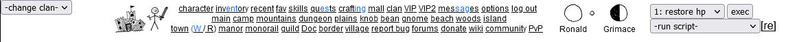

# mafia-relay-topmenu

Updated version of one of [Bale's Relay Override Scripts](https://kolmafia.us/threads/bales-relay-overrides.12644/) for the top menu.



# Installation

Run this command in the graphical CLI:

```
svn checkout https://github.com/fewyn/mafia-relay-topmenu/branches/main/RELEASE/
```

## What if I already have the sourceforge version installed?

If you are switching from the old sourceforge version of Bale's Topmenu, run this command before the previous command:

```
svn delete bale-relay-topmenu
```